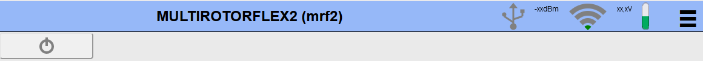
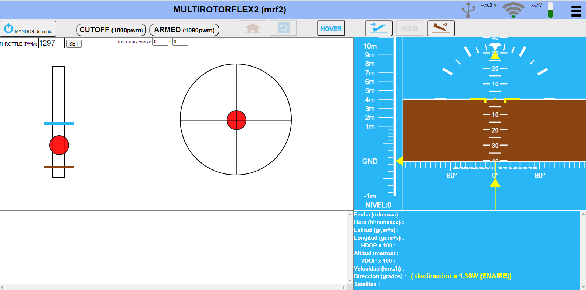
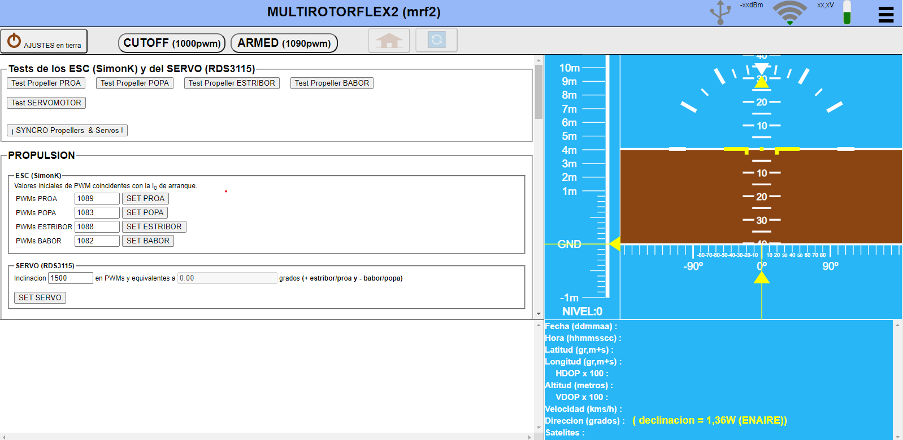

# MANDO Y CONTROL  

 Con esta aplicación Web ejerceremos el mando y control, y la parametrización online del drone **multirotorflex**.  

 Si es posible, el drone intentará conectarse a una red WiFi bien conocida; si no, creará su propia red Wifi (**multirotorflex** sin password) a la que podremos conectarnos via "10.0.0.1".  

   

 Pulsando el botón gris de encendido (lado izquierdo de la figura anterior), la aplicación basculará entre dos modos de funcionamiento pulsando repetidamente el botón de encendido, pasando su color a azul cielo (modo mando y control) o marrón tierra (modo parametrización online).

 ## modo mando y control

 ## modo parametrización online

## Nota: 

La aplicación esta disponible para su uso y disfrute en el link: [mando y control](https://martinico.github.io/mando-y-control/).  
